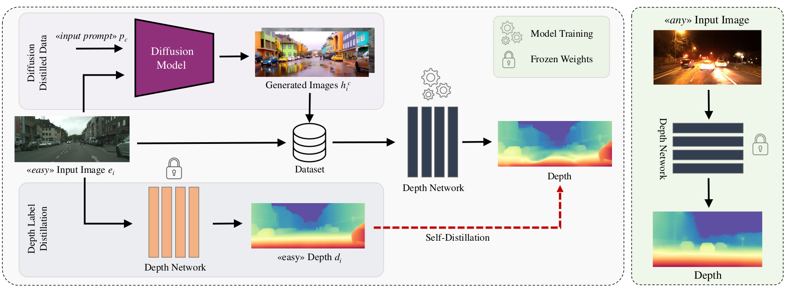
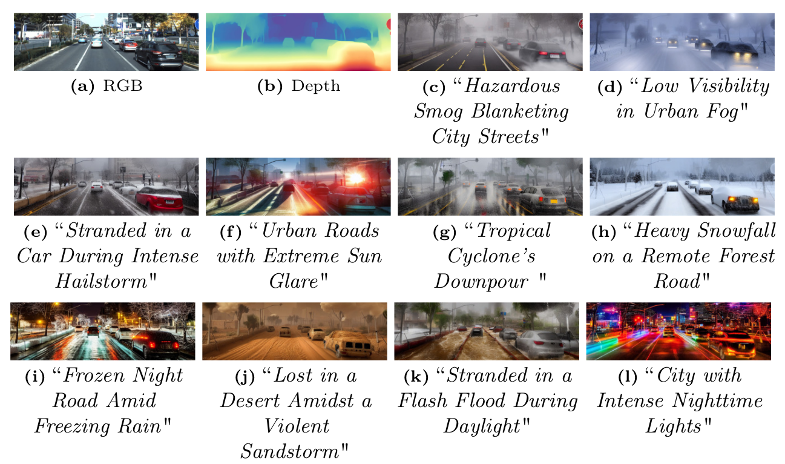
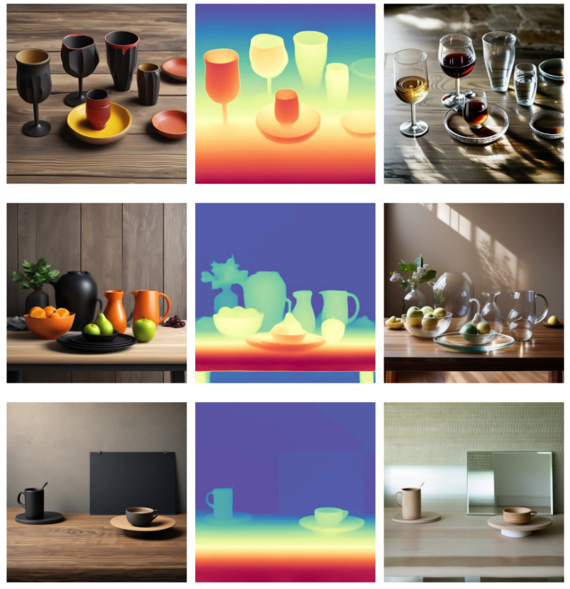
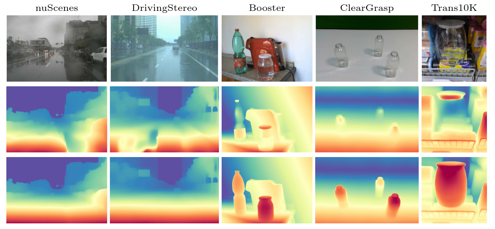
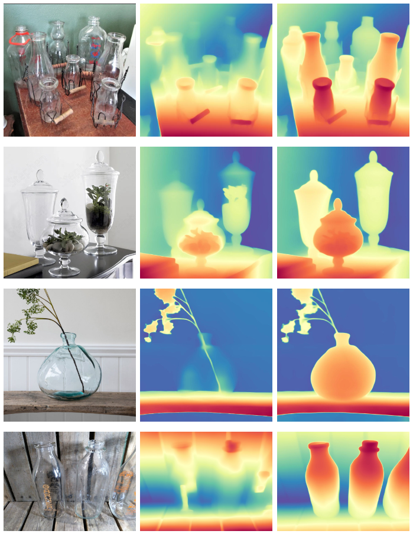
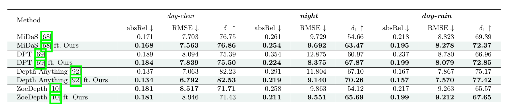
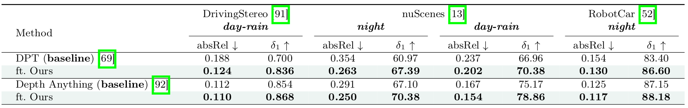
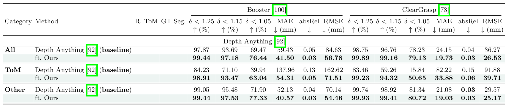
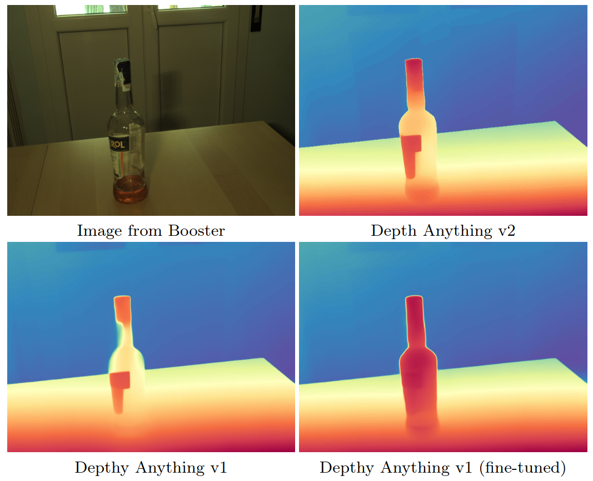
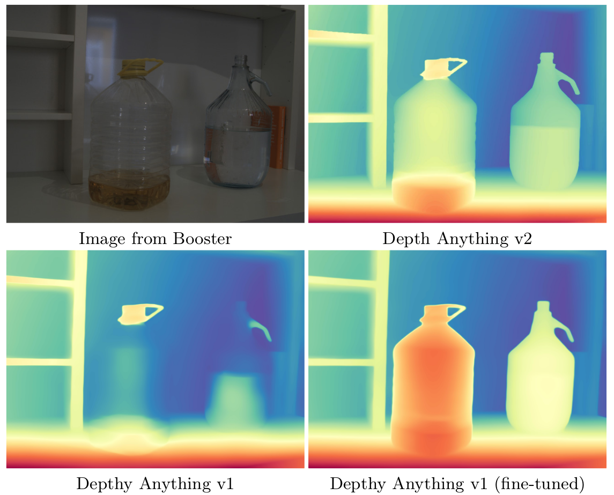

<h1 align="center"> Diffusion Models for Monocular Depth Estimation: Overcoming Challenging Conditions (ECCV 2024) </h1>

<br>

:rotating_light: This repository contains information about our work "**Diffusion Models for Monocular Depth Estimation: Overcoming Challenging Conditions**", [ECCV 2024](https://eccv2024.ecva.net/)
 
by [Fabio Tosi](https://fabiotosi92.github.io/), [Pierluigi Zama Ramirez](https://pierlui92.github.io/), and [Matteo Poggi](https://mattpoggi.github.io/)

University of Bologna

<div class="alert alert-info">

<h2 align="center">
  <a href="https://diffusion4robustdepth.github.io/">Project Page</a> |
  <a href="https://raw.githubusercontent.com/fabiotosi92/Diffusion4RobustDepth/main/assets/main.pdf">Paper</a> |
  <a href="https://raw.githubusercontent.com/fabiotosi92/Diffusion4RobustDepth/main/assets/supplement.pdf">Supplementary</a> |
  <a href="https://raw.githubusercontent.com/fabiotosi92/Diffusion4RobustDepth/main/assets/poster.pdf">Poster</a> |
  <a href="https://huggingface.co/datasets/fabiotosi92/Diffusion4RobustDepth">
     Dataset & Models
  </a>
</h2>

**Note**: 🚧 Kindly note that this repository is currently in the development phase. We are actively working to add and refine features and documentation. We apologize for any inconvenience caused by incomplete or missing elements and appreciate your patience as we work towards completion.

</div>

## :bookmark_tabs: Table of Contents

1. [Introduction](#clapper-introduction)
2. [Method](#gear-method)
3. [Dataset](#file_cabinet-dataset)
4. [Qualitative Results](#art-qualitative-results)
5. [Quantitative Results](#chart_with_upwards_trend-quantitative-results)
6. [Models](#computer-models)
7. [Potential for Enhancing State-of-the-Art Models](#-potential-for-enhancing-state-of-the-art-models)
8. [Citation](#fountain_pen-citation)
9. [Contacts](#envelope-contacts)
10. [Acknowledgements](#pray-acknowledgements)


## :clapper: Introduction

We present a novel approach designed to address the complexities posed by challenging, out-of-distribution data in the single-image depth estimation task. Our method leverages cutting-edge text-to-image diffusion models with depth-aware control to generate new, user-defined scenes with a comprehensive set of challenges and associated depth information.

**Key Contributions:**
- Pioneering use of text-to-image diffusion models with depth-aware control to address single-image depth estimation challenges
- A knowledge distillation approach that enhances the robustness of existing monocular depth estimation models in challenging out-of-distribution settings
- The first unified framework that simultaneously tackles multiple challenges (e.g. adverse weather and non-Lambertian)

## :gear: Method

Our approach addresses the challenge of monocular depth estimation in complex, out-of-distribution scenarios by leveraging the power of diffusion models. Here's how our method works:

1. **Scene Generation with Diffusion Models**: 
   We start with images that are easy for depth estimation (e.g., clear daylight scenes). Using state-of-the-art text-to-image diffusion models (e.g. ControlNet, T2I-Adapter), we transform these into challenging scenarios (like rainy nights or scenes with reflective surfaces). The novelty here is that we preserve the underlying 3D structure while dramatically altering the visual appearance. This allows us to generate a vast array of challenging scenes with known depth information.

2. **Depth Estimation on Simple Scenes**: 
   We use a pre-trained monocular depth network, such as DPT, ZoeDepth, Depth-Anything, to estimate depth for the original, unchallenging scenes. This provides us with reliable depth estimates for the base scenarios.

3. **Self-Distillation Protocol**: 
   We then fine-tune the depth network using a self-distillation protocol. This process involves:
   - Using the generated challenging images as input
   - Employing the depth estimates from the simple scenes as pseudo ground truth
   - Applying a scale-and-shift-invariant loss to account for the global changes introduced by the diffusion process

This approach allows the depth network to learn robust depth estimation across a wide range of challenging conditions.

<p align="center">
  
</p>

Key advantages of our method:
- **Flexibility**: By using text prompts to guide the diffusion model, we can generate an almost unlimited variety of challenging scenarios.
- **Scalability**: Once set up, our pipeline can generate large amounts of training data with minimal human intervention.
- **Domain Generalization**: By exposing the network to a wide range of challenging conditions during training, we improve its ability to generalize to unseen challenging real-world scenarios.


## :file_cabinet: Dataset

Our approach generates datasets for a variety of challenging conditions, demonstrating the versatility of creating diverse, realistic scenarios for robust depth estimation:

- Adverse weather (rain, snow, fog)
- Low-light conditions (night)
- Non-Lambertian surfaces (transparent and reflective objects)
- etc..

#### Arbitrary Weather Conditions in Driving Scenes

<p align="center">
  
</p>

This image demonstrates our ability to generate driving scenes with arbitrarily chosen challenging weather conditions. 

####  Transforming Opaque Materials into Transparent and Mirrored (ToM) Surfaces

<p align="center">
  
</p>

This figure illustrates our process of transforming easy scenes into challenging ones:
- **Left**: Original "easy" images, typically clear and well-lit scenes.
- **Center**: Depth maps estimated from the easy scenes, which serve as a guide for maintaining 3D structure.
- **Right**: Generated "challenging" images, showcasing various difficult conditions while preserving the underlying depth structure.


<p>
  You can access and download the dataset from: 
  <a href="https://huggingface.co/datasets/fabiotosi92/Diffusion4RobustDepth" target="_blank">
     Diffusion4RobustDepth Dataset
  </a>
</p>

## :art: Qualitative Results

#### Performance on Challenging Datasets

Our method significantly improves the performance of state-of-the-art monocular depth estimation networks. We show the ability of our approach to boost the capabilities of existing networks, such as Depth Anything in the following picture, across various challenging real-world datasets:

<p align="center">
  
</p>

#### Performance on Real-World Web Images

To further demonstrate the effectiveness of our approach, we tested the fine-tuned Depth Anything model using our generated dataset on a diverse set of challenging images featuring ToM surfaces sourced from the web:

<p align="center">
  
</p>


- **Left**: Original RGB images from various real-world scenarios.
- **Center**: Depth maps estimated by the original Depth Anything model.
- **Right**: Depth maps produced by our fine-tuned Depth Anything model.


## :chart_with_upwards_trend: Quantitative Results

Our approach improves performance across various scenarios and datasets:

#### Performance on nuScenes Dataset

<p align="center">

</p>


#### Cross-Dataset Generalization

<p align="center">

</p>

- Trained using only "easy" condition images (KITTI, Mapillary, etc.)

#### Performance on Transparent and Mirror (ToM) Objects

<p align="center">

</p>


## :computer: Models

<p>
  You can access and download the models from our Hugging Face repository: 
  <a href="https://huggingface.co/datasets/fabiotosi92/Diffusion4RobustDepth" target="_blank">
     Diffusion4RobustDepth Models
  </a>
</p>
<p>
  The repository includes both our generated dataset and the weights of the networks trained using our method.
</p>


## 🔍 Potential for Enhancing State-of-the-Art Models

> **Note**: Our work was submitted before the release of Depth Anything v2, which appeared on arXiv during the ECCV 2024 decision period.

Our framework shows potential for enhancing even state-of-the-art models like Depth Anything v2, which already performs impressively in challenging scenarios. The following example demonstrates how our method can improve depth estimation in specific cases:

##### Example 1

<p align="center">

</p>

##### Example 2

<p align="center">

</p>


## :fountain_pen: Citation

If you find our work useful in your research, please consider citing:

```bibtex
@inproceedings{tosi2024diffusion,
  title={Diffusion Models for Monocular Depth Estimation: Overcoming Challenging Conditions},
  author={Tosi, Fabio and Zama Ramirez, Pierluigi and Poggi, Matteo},
  booktitle={European Conference on Computer Vision (ECCV)},
  year={2024}
}
```

## :envelope: Contacts

For questions, please send an email to fabio.tosi5@unibo.it, pierluigi.zama@unibo.it, or m.poggi@unibo.it

## :pray: Acknowledgements

We would like to extend our sincere appreciation to the authors of the following projects for making their code available, which we have utilized in our work:

- [md4all](https://github.com/md4all/md4all)
- [Stable Diffusion](https://github.com/CompVis/stable-diffusion)
- [T2I-Adapter](https://github.com/TencentARC/T2I-Adapter)
- [Depth Anything](https://github.com/LiheYoung/Depth-Anything)
- [MiDaS](https://github.com/isl-org/MiDaS)
- [ZoeDepth](https://github.com/isl-org/ZoeDepth)

We also extend our gratitude to the creators of the datasets used in our experiments: nuScenes, RobotCar, KITTI, Mapillary, DrivingStereo, Booster and ClearGrasp.